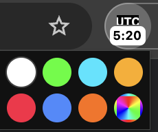

# UTC Clock

A minimal Chrome extension that displays the current UTC time in the toolbar badge, updated every minute.

## Features

- Displays UTC time in `H:MM` / `HH:MM` format directly in the toolbar
- Hover over the icon to see the full `YYYY-MM-DD HH:MM UTC` timestamp
- Accent color picker to customize the badge and icon colors

## Color Picker

Click the extension icon to open the color picker. The background is fixed to black — only the accent color (UTC label and badge) is customizable.

Choose from 7 presets or use the rainbow cell to pick any custom color. Your selection is saved and restored across browser sessions.

| Cell | Color |
|---|---|
| 1 | White (default) |
| 2 | Lime green |
| 3 | Electric cyan |
| 4 | Amber |
| 5 | Vivid red |
| 6 | Electric blue |
| 7 | Orange |
| 8 | Custom (any color) |
