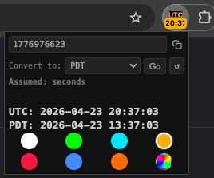

# UTC Clock & Epoch Converter

A minimal Chrome extension that displays the current UTC time in the toolbar badge, updated every minute.

## Features

- 🕐 Displays UTC time in `H:MM` / `HH:MM` format directly in the toolbar badge
- 🖱️ Hover over the icon to see the full `YYYY-MM-DD HH:MM UTC` timestamp
- 🎨 Accent color picker to customize the badge and icon — choose from 7 presets or pick any custom color
- 🔢 Built-in Unix timestamp converter supporting seconds, milliseconds, microseconds, and nanoseconds
- 📋 One-click copy to clipboard for the current epoch time
- 💾 All preferences saved and restored across browser sessions

## Popup

Click the extension icon to open the popup.

### Epoch Converter

- 🔄 The textbox shows the live Unix epoch time in seconds, updating every second
- ✏️ Click the textbox to pause auto-update and type any Unix timestamp
- 🧠 Auto-detects the unit (seconds / milliseconds / microseconds / nanoseconds) based on digit count and displays it below the UTC time
- ▶️ Click **Convert** to convert the entered value to UTC — auto-update stays frozen after conversion
- ↺ Click the **reset** button to discard your input and resume live updates
- 🚪 Closing and reopening the popup also resumes live updates

### Color Picker

- 🎨 The accent color (UTC label and badge) is customizable - Choose from 7 presets or click the rainbow cell to open the OS color picker for any custom color
- ⚡ Color changes apply instantly to the toolbar icon and badge

| Cell | Color |
|---|---|
| 1 | White |
| 2 | Lime green |
| 3 | Electric cyan |
| 4 | Amber (default) |
| 5 | Vivid red |
| 6 | Electric blue |
| 7 | Orange |
| 8 | Custom (any color) |
