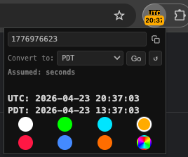

# UTC Clock & Epoch Converter

**Available on the Chrome Web Store:** [UTC Clock & Epoch Converter](https://chromewebstore.google.com/detail/utc-clock-epoch-converter/jooaafohejjogngjddkfnjphegfngbla)

A minimal Chrome extension that displays the current UTC time in the toolbar badge, updated every minute.

## Features

- 🔢 Built-in Unix timestamp converter supporting seconds, milliseconds, microseconds, and nanoseconds
- 🌍 Convert any timestamp to 18 timezones — result updates live every second
- 🎨 Accent color picker to customize the badge and icon — choose from 7 presets or pick any custom color
- 💾 All preferences (color, selected timezone, converter state) saved and restored across sessions



## Development

Run `npm install` after cloning to wire up the git hooks. Tests run automatically before each commit via a pre-commit hook (`hooks/pre-commit`) — the commit is blocked if any test fails. To run tests manually:

```
npm test
```